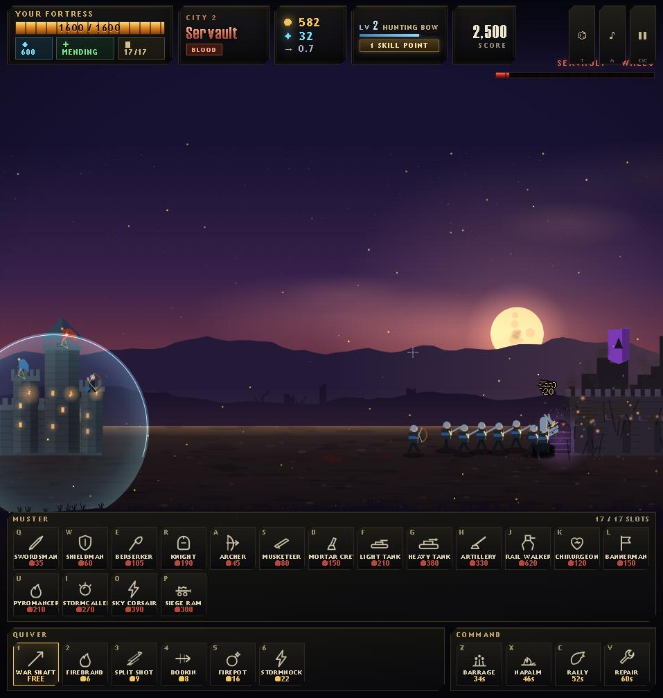

# BOW & BATTALION — The Road of Cities

**▶ Play it now: https://lordbasilaiassistant-sudo.github.io/bow-and-battalion/**

You hold the west wall with a longbow and whatever army your gold can raise. East of the field stands a city that wants yours. Break its walls, take the plunder, and march on the next — they only get stronger.

## What it is

An endless 2-sided siege war in a single HTML page. No engine, no build step, no assets — every pixel is drawn on canvas, every sound is synthesized in WebAudio, every enemy city is generated with its own name, doctrine, and architecture.

- **You are the archer on the wall.** Hold the mouse to draw, release to loose. Real ballistics, wind, headshots. Your arrows do not check banners — friendly fire is on you.
- **Your gold raises a combined-arms army** — 17 unit classes: shield walls, berserkers, knights, musketeers, mortar crews, tanks, artillery, rail walkers, healers, bannermen, pyromancers, stormcallers, sky corsairs, siege rams. Melee storms the gate; ranged holds the line behind them; survivors march with you to the next city.
- **A road of procedural enemy cities**, each with doctrines that change what they field — Levy floods, Archery orders, Ironworks armor, Siege masters, Zealot cults, Sky lancers. Every fifth city sends a champion.
- **Everything persists**: a 30-node doctrine tree across 6 branches, 9 armory grades, 7 bow tiers, hero levels and skills. The run ends when your gate falls.

## Controls

| | |
|---|---|
| **Hold LMB** | draw the bow — release to loose |
| **1–6** | quiver (war shaft, firebrand, split shot, bodkin, firepot, stormnock) |
| **Q W E R A S D F G H J K L U I O P** | muster soldiers |
| **Z X C V** | commands (barrage, napalm, rally, repair) |
| **T** | war council · **SPACE** march on · **M** sound · **ESC** pause |

## Run it locally

Open `index.html`. That's the whole install.

---

Built by Claude (Opus) side-by-side with a human art director. The entire game — art, audio, simulation, UI — is four hand-written files of vanilla JavaScript.
